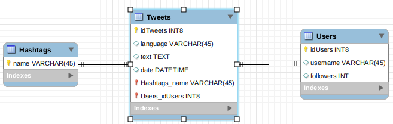
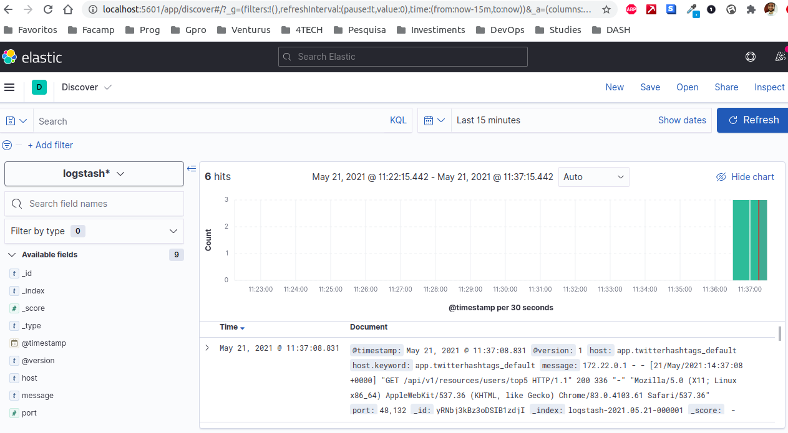
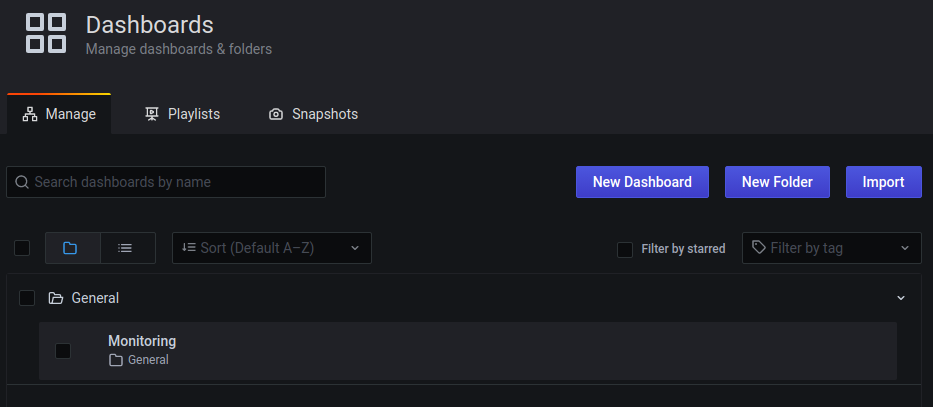
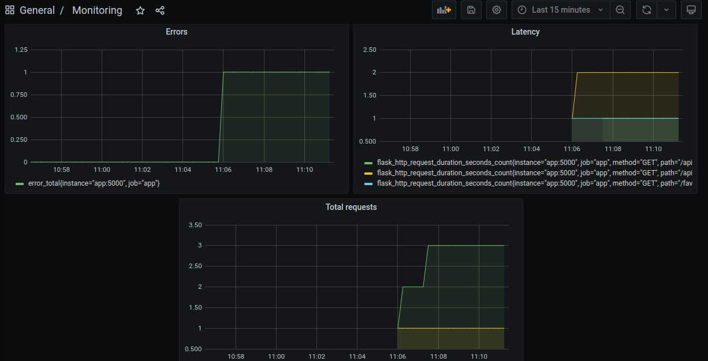

# Twitter-hashtags
## 1. Projeto
Este projeto consiste em coletar dados de tweets do Twitter, armazenar em uma base de dados e construir uma API para consumir os dados armazenados.

Os dados foram obtidos do Twitter utilizando um token atrelada a uma conta de desenvolvimento de tíer Standard.
https://developer.twitter.com/en/docs/twitter-api/tweets/search/api-reference/get-tweets-search-recent

Foram realizadas queryes para as seguintes hashtags:
- #openbanking
- #remediation
- #devops
- #sre
- #microservices
- #observability
- #oauth
- #metrics
- #logmonitoring
- #opentracing

OBS: A API do twitter possui algumas limitações como, por exemplo, não retornar dados mais antigos que uma semana. Portanto, algumas hashtags não trouxeram resultados (#logmonitoring)

## 2. Tecnologias utilizadas
- ELK stack (Elasticsearch, Logstash e Kibana)
- Flask
- Grafana
- Gunicorn
- Mysql
- Prometheus
- Python
  
## 3. API
A API foi construída utilizando o framework Flask, baseado na linguagem Python. Foram criados 7 endpoints para consumo, contando com as seguintes funcionalidades:
- retornar todos os tweets armazenados no banco
- retornar todos os usuários armazenados no banco
- retornar todas as hashtags armazenadas no banco
- retornar os 5 usuários com mais seguidores
- retornar os tweets por parâmetros(linguagem, ID do autor, hashtag)
- retornar todos os tweets agrupados por hora do dia
- retornar todos os tweets para cada linguagem e hashtag

A API acessa dados de um banco relacional Mysql, que conta com 3 tabelas, como pode ser observado no MER(Modelo Entidade Relacionamento) abaixo:


O json de collection a ser importado no Postman se encontra dentro da pasta app.
## 4. Arquitetura
Foi utilizado o docker compose para criação do ambiente. Docker compose possibilita o orquestramento de vários contêineres através de um único código.

Foram criados 7 contêineres, um para cada serviço utilizado:
- Banco de dados Mysql
- API flask
- Logstash
- Elasticsearch
- Kibana
- Prometheus
- Grafana

Ao subir o ambiente com o docker compose, o contêiner do banco de dados cria as tabelas automaticamente, o contâiner de aplicação espera por 30 segundos (até que as tabelas estejam criadas), roda o script de coletar dados do twitter (get_info.py) e começa o serviço do flask rodando através do Gunicorn. O Gunicorn foi utilizado para gerar os logs da API Flask.

Ao mesmo tempo são criados os outros contêineres para coletar e visualizar os logs e as métricas da aplicação. O Logstash recebe os logs do Gunicorn e envia para o elasticsearch, e assim é possível vê-los pelo Kibana (o index pattern do logstash é criado automaticamente também). Por fim, o Prometheus coleta as métricas da aplicação Flask e o grafana é utilizado para visualizá-las. O dashboard também já sobe ao rodar o docker compose.
## 5. Subir ambiente
Para subir o ambiente é bem simples, basta rodar o script start_environment.sh, e ele fará o build da imagem docker a ser utilizada para a aplicação Python e também já rodará o docker compose e esperará a aplicação subir.

```
chmod 755 start_environment.sh
./start_environment.sh
```

Para derrubar o ambiente, basta rodar

```
docker-compose down
```

Por fim, o script faz um POST para o endereço do Kibana criar o index pattern e já ser possível observar os logs da aplicação em tempo real.
## 6. Logging
Para acessar aos logs da aplicação, basta entrar no endereço do kibana, que irá rodar na porta 5061:

http://localhost:5061

E acessar a aba Discover. Os logs serão mostrados da seguinte forma:



## 7. Monitoring
Para acessar aos painéis de monitoramento, basta entrar no endereço do Grafana, que irá rodar na porta 3000:

http://localhost:3000

E colocar as credenciais:

```admin:pass@123```

A senha é customizável no docker-compose, para alterá-la e subir o ambiente com uma senha diferente, basta mudar o parâmetro "GF_SECURITY_ADMIN_PASSWORD" para o valor desejado, antes de rodar o script.

O dashboard "Monitoring" estará dentro da pasta General



E será apresentado assim:



## 8. Outras informações úteis

Prometheus: http://localhost:9090

Elasticsearch: http://localhost:9200

O usuário e senha do banco de dados mysql também é customizável pelo docker-compose.yml. Mas lembre-se de, caso queira alterá-los, mudar também os parâmetros do contêiner de aplicação para ficar iguais aos do banco.